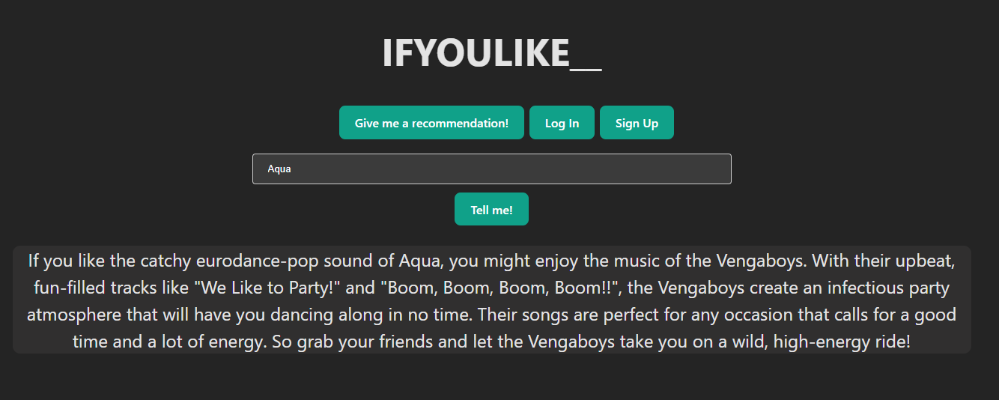

# ifyoulike

ifyoulike* is a recommendation engine leveraging the power of the OpenAI API to provide suggestions based on user preferences. Whether you're exploring new entertainment genres or expanding on current ones, ifyoulike* is here to guide your journey.
Try

[Try it here!](https://ifyoulike-front.onrender.com/)


## Features

- **Get Recommendations**: Users can receive suggestions without any account.



- **Save Past Recommendations**: Create an account to save and revisit your past recommendations anytime.

## Technology Stack

- **Frontend**: React, Viste
- **Backend**: Express, Node.js
- **Database**: MongoDB
- **External API**: OpenAI

## Getting Started

### Prerequisites

- Node.js
- MongoDB
- OpenAI API key

### Installation

1. **Clone the Repository**

   ```bash
   git clone https://github.com/your-username/ifyoulike_.git
   cd ifyoulike_
   ```

2. **Install Dependencies**

   ```bash
   # Install frontend dependencies
   cd frontend
   npm install

   # Install backend dependencies
   cd ../backend
   npm install
   ```

3. **Environment Variables**

   Create a `.env` file in the backend directory. Here's a sample configuration:

   ```
   OPENAI_API_KEY=YOUR_OPENAI_API_KEY
   MONGO_URI=YOUR_MONGODB_CONNECTION_URI
   SECRET_KEY=YOUR_SECRET_KEY_FOR_JWT
   ```

4. **Run the Application**

   In the `backend` directory:

   ```
   npx nodemon server.js
   ```

   In the `frontend` directory:

   ```
   npm run dev
   ```

   Now, you should be able to access the application at `http://localhost:3000`.

## License

This project is licensed under the MIT License - see the `LICENSE.md` file for details.

---
